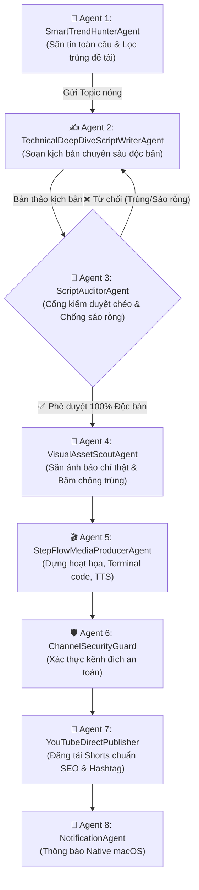

# 🧠 LIDO AI LAB - BẢN ĐẶC TẢ VAI TRÒ & KỸ NĂNG CỦA BIỆT ĐỘI AI AGENTS

Tài liệu này định nghĩa rõ ràng cấu trúc tổ chức, kỹ năng chuyên biệt (Agent Skills) và quy trình phối hợp khép kín giữa các AI Agents trong toàn bộ chuỗi dây chuyền sản xuất video YouTube Shorts công nghệ cao của kênh **[@LidoAILab](https://www.youtube.com/@LidoAILab)**.

---

## 🏛️ Sơ Đồ Phối Hợp Đa Tác Nhân (Agent Workflow Pipeline)

---

## 📋 Chi Tiết Vai Trò & Kỹ Năng Của Từng Agent

### 1. `SmartTrendHunterAgent` (Radar Trinh Sát Tin Tức Toàn Cầu)
* **Trách nhiệm chính:** Quét 15+ cổng thông tin công nghệ hàng đầu thế giới (TechCrunch, The Verge, MIT Tech Review, HackerNews, Google News US/Global/VN).
* **Kỹ năng cốt lõi (Skills):**
  * `fetch_all_fresh_topics`: Cào tin tức thời gian thực với các bộ lọc điểm số hot từ 100+ từ khóa AI hàng đầu (LLM, Video AI, Coding Agents, Robot hình người, Chip bán dẫn).
  * `semantic_keyword_overlap`: So sánh ma trận từ khóa của tin tức mới với `seen_news.json`. Nếu bài viết có độ trùng từ 3 từ khóa ý nghĩa với bất kỳ video nào trong quá khứ -> lập tức loại bỏ.
  * `extract_and_learn_from_text`: Tự động học các thực thể công nghệ mới vào Knowledge Base.

---

### 2. `TechnicalDeepDiveScriptWriterAgent` (Biên Kịch Kỹ Thuật Độc Bản)
* **Trách nhiệm chính:** Chuyển hóa tiêu đề bài báo thành kịch bản phân cảnh chuyên sâu, bám sát từng chi tiết cốt lõi.
* **Kỹ năng cốt lõi (Skills):**
  * `hyper_specific_storytelling`: Tuyệt đối không dùng chung một khuôn mẫu. Phân tích bài báo theo 17+ tình tiết nghiệp vụ thực tế (Nghi vấn bóp hiệu năng, Rò rỉ ảnh riêng tư, Bóc mẽ benchmark, Tranh chấp bản quyền Sora, Công nhân phản đối robot, Nền tảng điều phối Agent, Chip Agentic PC...).
  * `terminal_command_sync`: Thiết kế câu lệnh dòng lệnh (CLI), trạng thái runtime và kết quả Unit Test khớp 100% với chủ đề kỹ thuật của bài báo.
  * `hook_and_cta_generator`: Tạo câu mở đầu giật gân, phân tích nguyên nhân sâu xa, đề xuất giải pháp thực tế và kêu gọi đăng ký kênh tự nhiên.

---

### 3. `ScriptAuditorAgent` (Cổng Kiểm Duyệt Chéo & Giữ Gìn Chất Lượng)
* **Trách nhiệm chính:** Đóng vai trò Giám đốc kiểm duyệt chất lượng nội dung trước khi chuyển sang bước dựng video và tạo giọng đọc.
* **Kỹ năng cốt lõi (Skills):**
  * `cross_check_seen_scripts`: So khớp văn bản lời thoại mới với toàn bộ kho kịch bản quá khứ trong `seen_scripts.json` bằng thuật toán Jaccard Similarity. Nếu độ trùng cụm từ > 35% -> **TỪ CHỐI**.
  * `ban_template_cliches`: Quét và chặn đứng các mẫu câu sáo rỗng (như: *"các chuyên gia bảo mật phát hiện hệ thống đã phát sinh hành vi nguy hiểm"*, *"phá vỡ giới hạn hiệu năng cũ"*, *"bước ngoặt đang được toàn bộ Thung lũng Silicon..."*).
  * `entity_relevance_gate`: Đảm bảo các thực thể chính của tiêu đề bài báo xuất hiện trực tiếp trong câu thoại đầu tiên.

---

### 4. `VisualAssetScoutAgent` (Thám Tử Săn Ảnh Thực Tế)
* **Trách nhiệm chính:** Tìm kiếm hình ảnh báo chí, linh kiện hoặc giao diện phần mềm thực tế phù hợp với chủ đề.
* **Kỹ năng cốt lõi (Skills):**
  * `multi_query_search`: Truy vấn ảnh chất lượng cao theo nhiều góc độ (sản phẩm, logo công ty, robot trong xưởng, giao diện phần mềm).
  * `content_hashing_validator`: Băm nội dung MD5/SHA256 của từng bức ảnh tải về để ngăn chặn việc sử dụng lại cùng một tấm ảnh cho các phân cảnh khác nhau.

---

### 5. `StepFlowMediaProducerAgent` (Đạo Diễn Hoạt Họa & Âm Thanh)
* **Trách nhiệm chính:** Kết hợp kịch bản, âm thanh giọng đọc và đồ họa thành video Shorts hoàn chỉnh.
* **Kỹ năng cốt lõi (Skills):**
  * `neural_speech_synthesis`: Chuyển kịch bản thành giọng đọc truyền cảm (`vi-VN-NamMinhNeural` tốc độ +4%).
  * `step_flow_motion_engine`: Dựng quy trình kỹ thuật từng bước (Bước 1 $\rightarrow$ Mũi tên động $\rightarrow$ Bước 2 $\rightarrow$ Cửa sổ Terminal gõ code thời gian thực $\rightarrow$ Bước kiểm thử & Con dấu bảo vệ).
  * `karaoke_highlight_subtitles`: Đồng bộ phụ đề bắt sáng màu Cyan (`#00F5FF`) chuẩn xác theo nhịp đọc.

---

### 6. `ChannelSecurityGuard` (Rào Chắn Bảo Mật Kênh)
* **Trách nhiệm chính:** Ngăn ngừa rủi ro định tuyến sai kênh hoặc rò rỉ thông tin xác thực.
* **Kỹ năng cốt lõi (Skills):**
  * `verify_channel_destination`: Kết nối YouTube Data API v3 kiểm tra ID kênh phải trùng khớp 100% với `@LidoAILab` (`UCcegmQUbGsoFqRlQa_ULy7g`) trước khi cho phép tiến trình upload bắt đầu.
  * `credential_sanitizer`: Bảo đảm toàn bộ token OAuth và tệp nhạy cảm không bị đưa lên Git hoặc log công khai.

---

### 7. `YouTubeDirectPublisher` (Nhà Xuất Bản YouTube Trực Tuyến)
* **Trách nhiệm chính:** Đăng tải video lên YouTube Shorts qua API chính thức.
* **Kỹ năng cốt lõi (Skills):**
  * `metadata_seo_optimization`: Tự động điền tiêu đề chuẩn SEO, mô tả trích dẫn nguồn báo chí quốc tế đầy đủ và gắn hashtag xu hướng.
  * `rate_limiting_scheduler`: Duy trì nhịp đăng an toàn (tối thiểu 15 phút/video) để bảo vệ điểm tín nhiệm của kênh trước thuật toán chống spam của YouTube.

---

### 8. `NotificationAgent` (Sứ Giả Thông Báo Hệ Thống)
* **Trách nhiệm chính:** Thông báo kết quả trực tiếp cho người quản trị.
* **Kỹ năng cốt lõi (Skills):**
  * `macos_native_alert`: Phát âm thanh và hiển thị thông báo popup kèm link xem Shorts ngay trên màn hình macOS khi video xuất bản thành công.
